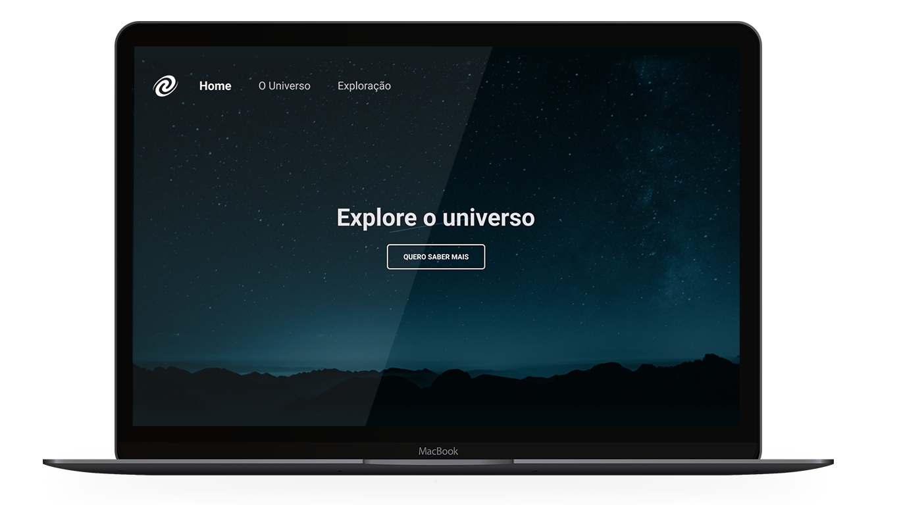

<p align="center">
  <a href="#-spa-universe">About</a>&nbsp;&nbsp;&nbsp;|&nbsp;&nbsp;&nbsp;
  <a href="#-technologies">Technologies</a>&nbsp;&nbsp;&nbsp;|&nbsp;&nbsp;&nbsp;
  <a href="#-run-locally">Run locally</a>&nbsp;&nbsp;&nbsp;|&nbsp;&nbsp;&nbsp;
  <a href="#-license">License</a>&nbsp;&nbsp;&nbsp;|&nbsp;&nbsp;&nbsp;
  <a href="#-developer">Develoepr</a>
</p>

<h2 align="center">SPA Universe</h2>
<div align="center">
  
</div>

## 🚀 SPA Universe

SPA Universe is a Single Page Application(SPA) which was developed as a part of the Explorer program by [Rocketseat](htttps://rocketseat.com.br).
The main idea is to apply the concepts learned about SPA applications and how they work. The application itself is quite simple, but the concepts applied made me understand more about the behavior of apps developed using front-end libraries and frameworks.

#### Functionalities

- route navigation

## 🚀 Technologies

- HTML5
- CSS3
- JavaScript (ESModules)

## 💻 Run locally

- clone this repo

```bash
  git clone git@github.com:vmsiqueira/spauniverse.git
```
- access your project directory via terminal
- install the dependencies

```bash
  npm install
```
- run the application using the following command.
```bash
  npm start
```

## ⚖️ License

This project is under MIT License. Check the [LICENSE](https://github.com/vmsiqueira/spa-universe/blob/main/LICENSE) file for more details.


## 🌐 Developer
 <br>
- [Vitor Siqueira](https://www.github.com/vmsiqueira)

[](https://www.linkedin.com/in/vitor-siqueira-149a88201/)

---
Made with 💜 as part of my developer formation.

